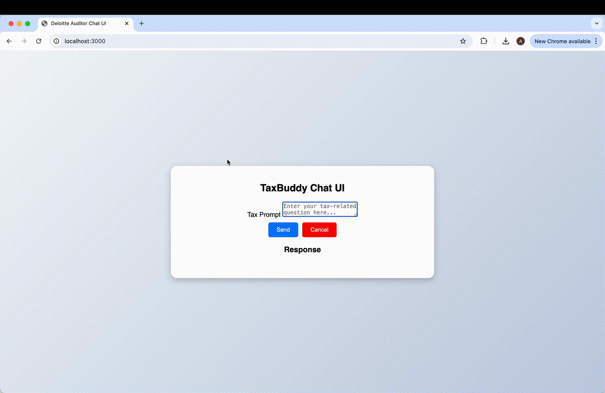

# TaxBuddy



## 📌 Project Setup Instructions

Follow the steps below to set up and run the TaxBuddy project on your local machine.

### **Prerequisites**
- Ensure you have **Node.js** installed. Download and install it from [Node.js Official Website](https://nodejs.org/)
- Git must be installed. Download it from [Git Official Website](https://git-scm.com/)

---

### **🚀 Installation & Setup**
#### **Step 1: Install Node.js**
Download and install **Node.js** from the [official website](https://nodejs.org/). It includes **npm (Node Package Manager)** by default.

#### **Step 2: Verify Installation**
Run the following commands in the terminal to verify that Node.js and npm are installed correctly:
``` 
node -v   # Verify Node.js version
npm -v    # Verify npm version
```

##### **Step 3: Clone the Repository**
```
git clone https://github.com/Arpitha-Nagaraj/TaxBuddy.git
```

##### **Step 4: Navigate to the Project Directory**
```
cd TaxBuddy
```
#### **Step 5: Install Dependencies**
```
npm install
```
#### **Step 6: Start the Application**
```
npm start
```
#### **Step 7: Access the Application**
```
http://localhost:3000
```


